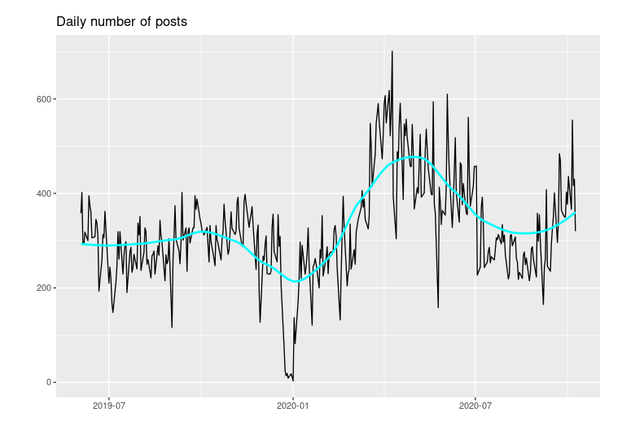

```{r setup, include=FALSE}
knitr::opts_chunk$set(echo = FALSE)

#Get tweets on HR and HR Analytics from twitter (if not already loaded into memory)
if (!'en_tweets'%in%ls()){
  source('../scripts/nlp0_get_hr_tweets.R')
}
```

## NLP for Employee Listening 

<div class="columns-2">
<br><br>
So... I have a 10-month old daughter, and have been doing a lot of Natural Language Processing (NLP) work lately. 

Thus, it is only appropriate for me to marry some NLP thinking with nursery rhymes.  

- **NLP nimble**: Act on insights in near-real time
- **NLP quick**: It's never been easier get started doing NLP 
- **NLP the candle stick**: don't burn the trust of your colleagues! 

<br><br>
{width=100%}

</div>
## Nimble: React to company-specifc issues

Text analysis/NLP used in a continuous listening strategy comprised of both:

1) Open-ended questions in frequent pulse surveys 
2) Observation of aggregate themes/trends on enterprise social media platforms 

... allows you to act fast and help your employees adapt to change quickly.

### **Major company events:**

- Pulse surveys: **"What do you need from leaders in light of our recent spin-off announcement?"**
- Aggregated social media data: **Posts containing "spin-off" or "acquisition"**
  
### **Employer brand:**

- Pulse surveys: **What steps should we take to make our company a great place to work?**
- Aggregated social media data: **Posts containing "proud" or "fulfilling"**

## Nimble: React to societal issues 

### **COVID-19 and adapting to change**
- Pulse surveys: **"What's the biggest barrier to getting your work done at home?"**
- Aggregated data from public posts on internal social media: **Posts containing 'work from home' or 'WFH'**

### **Racial Justice and Diversity and Inclusion**
- Aggregated data from public posts on internal social media: Posts containing 'George Floyd', 'Diversity and Inclusion', etc.

## NLP Quick: It's never been easier to get started

**All you need**

- Text data in a spreadsheet

- Time and (free) tools to:
    - Clean text data
    - Slice and Aggregate text data by attribute, time frame, or topic of interest

## NLP Quick: Don't make it complicated

### Letting the data speak for itself
- "What are people talking about generally?"
- Top two-word phrases (*Bigram frequency Analysis*)

### Look for specific words or phrases
- "What are people talking about when they mention X"
- Word/phrase search, followed by top two-word phrases

## NLP the candle stick: Don't burn your colleagues' trust!

**Never EVER** 
- Focus on the individual
- Expose insights that can identify an individual

*ALWAYS*

1. Understand what you're doing with modeling or sentiment analysis:
  - Do you understand how algorithms affect your conclusions? 
  - Are you enough of a linguist to trust sentiment scores?
2. Are you being lazy?
  - Computers aren't a substitute for old-fashioned reading
2. Have an aggregation policy that
  - Sets a minimum number of comments/posts that guarantees anonymity (usually 20).
  - Describes how you will share data with others
3. Communicate to your employees:
  - Intention of using their responses or activity on corporate systems **for good!**
  - Who gets to see their information
  - Your aggregation and privacy policies

  
## Next steps - get started!

<center>


This presentation was created using R and RStudio. 

All code that made these slides (including the code for charts and graphs) is available to you on Github to get started.

or visit 

Feel free to share among your people analytics teams!


    