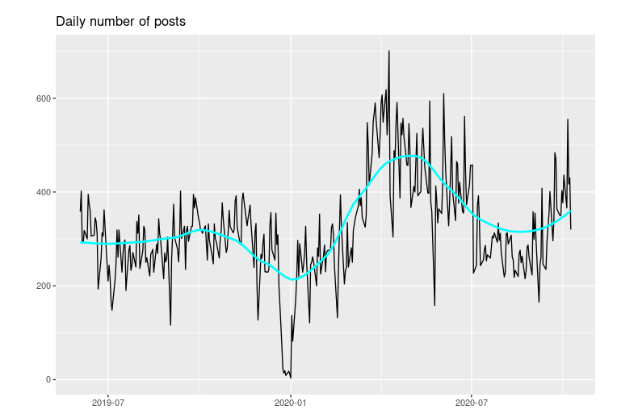
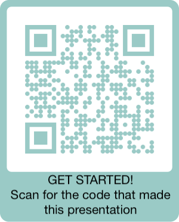

```{r setup, include=FALSE}
library(tidyverse)
library(tidytext)
library(gridExtra)
library(tm)

knitr::opts_chunk$set(echo = FALSE)

#Get tweets on HR and HR Analytics from twitter (if not already executed - this takes time to run)
if (!file.exists('../scripts/temp_out/en_tweets.RDS')){
  source('../scripts/nlp0_get_hr_tweets.R')
} else{
  en_tweets<-readRDS('../scripts/temp_out/en_tweets.RDS')
}

#Run script that pulls posts on certain topics (in this edition COVID 19 and D&I)
source('../scripts/nlp1_posts_containing_specific_topics.R')

#Run script that identify topics by bigram (two-word phrase) frequency analysis
source('../scripts/nlp2_generate_topics_from_text.R')

#Run script that makes graphs from bigram frequency analysis
source('../scripts/nlp3_generate_graphs_on_topics.R')


#give an example of text cleaning
raw_tweet<-en_tweets[59,"text"][[1]]
raw_tweet<-gsub('\n\n','\n',raw_tweet)

cleaned_tweet<-gsub('http\\S+','',raw_tweet)
cleaned_tweet<-gsub('\\#\\S+','',cleaned_tweet)
cleaned_tweet<-gsub('\\@\\S+','',cleaned_tweet)
cleaned_tweet<-gsub('(\u00a9|\u00ae|[\u2000-\u3300]|\ud83c[\ud000-\udfff]|\ud83d[\ud000-\udfff]|\ud83e[\ud000-\udfff])','',cleaned_tweet)
cleaned_tweet<-removeWords(cleaned_tweet,stopwords('en'))
cleaned_tweet<-removePunctuation(cleaned_tweet)
cleaned_tweet<-stripWhitespace(cleaned_tweet)
```

## NLP for Employee Listening 

<div style="float: right; width: 50%;">
<br><br>
So... I have a 10-month old daughter, and have been doing a lot of Natural Language Processing (NLP) work lately. 

Thus, it is only appropriate for me to marry some NLP thinking with nursery rhymes.  

- **NLP nimble**: Act on insights in near-real time
- **NLP quick**: It's never been easier get started doing NLP 
- **NLP the candle stick**: don't burn the trust of your colleagues! 
</div>

<div style="float: left; width: 50%;">
<br><br>
{width=100%}

</div>
## Nimble: React to company-specific issues {.build}

Text analysis/NLP used in a continuous listening strategy comprised of both:

1) Open-ended questions in frequent pulse surveys 
2) Observation of aggregate themes/trends on enterprise social media platforms 

... allows you to act fast and help your employees adapt to change quickly.

### **Major company events:**  

- Pulse surveys: **"What do you need from leaders in light of our recent acquisition announcement?"**
- Aggregated social media data: **Posts containing "M&A" or "acquisition"**
  
### **Employer brand:** 

- Pulse surveys: **What steps should we take to make our company a great place to work?**
- Aggregated social media data: **Posts containing "proud" or "fulfilling"**

## Nimble: React to societal issues 
<div style="float: left; width: 50%;">
```{r Top Societal Topics Chart, fig.height=5, fig.width=6.25, message=FALSE, warning=FALSE}
grid.arrange(covid_chart, d_i_chart)
```
</div>

<div style="float: right; width: 35%;">
### **COVID-19**
- Pulse surveys: **"What's the biggest barrier to getting your work done at home?"**
- Aggregated data from public posts on internal social media: **Posts containing 'work from home' or 'WFH'**

### **Racial Justice and D&I**
- Aggregated data from public posts on internal social media: **Posts containing 'George Floyd', 'Diversity and Inclusion', etc.**

</div>

## Quick: It's never been easier to get started {.build}

<div style="float: left; width: 45%;">

### **What you need**

1. Text data in a spreadsheet

2. Time and (free) tools to:
    + Clean text data
    + Divide text into 'tokens' (usually individual words or groupings of words)
    + Slice and aggregate text data by comment/poster attribute, time frame, or topic of interest

</div>

<div style="float: right; width: 50%;">

### **Getting from raw data**

<div class="blue">
<font size= "2">
`r raw_tweet`
</font>
</div>

<font size= 3>

Raw data is filled with things that aren't always useful or understandable to machines:

* Common words (of, is, the, they, we)
* URLs, Hashtags, emoji
* Unusual characters and white space
* Foreign languages 

</font>

### **...to machine-useable data**

<div class="blue">
<font size="2">
`r cleaned_tweet`
</font>
</div>

## Quick: No need for complicated analytics 

<div style="float: left; width: 35%;">

### <font size=4>**1. Let the data speak for itself**
- "What are people talking about generally?"
- Top two-word phrases (*bigram frequency analysis*)
</font>
<br><br>


### <font size=4>**2. Then, look for specific cuts**
- "What are people talking about when they mention X"
- "What are people in X division, or Y division saying?"
- Word/phrase search, followed by top two-word phrases
</font>
</div>

<div style="float: right; width: 60%;">
```{r Top General and PA Topics Chart, fig.height=5, fig.width=6.05, message=FALSE, warning=FALSE}
grid.arrange(all_topics_chart, p_a_chart)
```
</div>

## NLP the candle stick: Don't burn trust!
<div style="float: left; width: 30%;">
<span style="color:red">**Never EVER**</span>

1. **Not read** raw comments or posts!! Machines and NLP are not silver bullets. 

2. Share insights with others that could **identify an individual**!

</div>

<div style="float: right; width: 65%;">

<span style="color:green">**ALWAYS**</span>


1. **Understand the math** behind modeling or sentiment analysis:
    + Do you understand how algorithms or lexicons affect your conclusions? 
    + Can you explain to someone else how a sentiment score works?
2. Have an **aggregation and privacy policy** that:
    + Sets a minimum number of comments/posts that guarantees anonymity (usually 20) when sharing results
    + Describes with whom you will share data
    + Sets limits on the use of the data (aka never for performance purposes)
3. **Communicate to your employees:**
    + Intention of using their responses or activity on corporate systems **for good!**
    + Who gets to see what they've said
    + Your aggregation and privacy policies
</font>
</div>
  
## Next steps - get started!

<center>

{height=250px}
<br>
This presentation was created using R and RStudio. 

All code that made these slides (including the code for charts and graphs) is available to you

Scan the QR code above or visit [github.com/bvoorhees/presentations](https://github.com/bvoorhees/presentations)

Feel free to share among your people analytics teams!